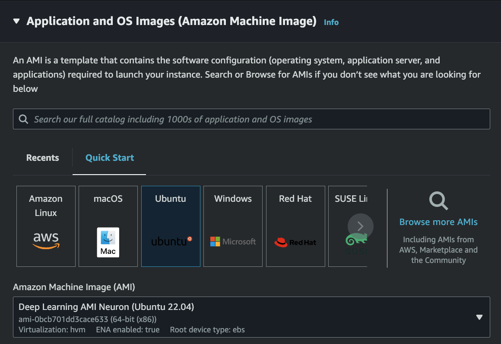
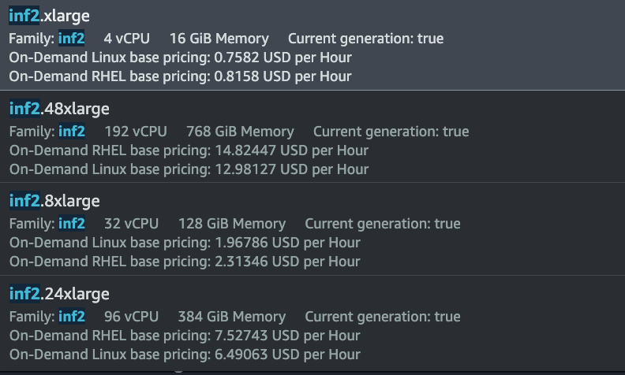
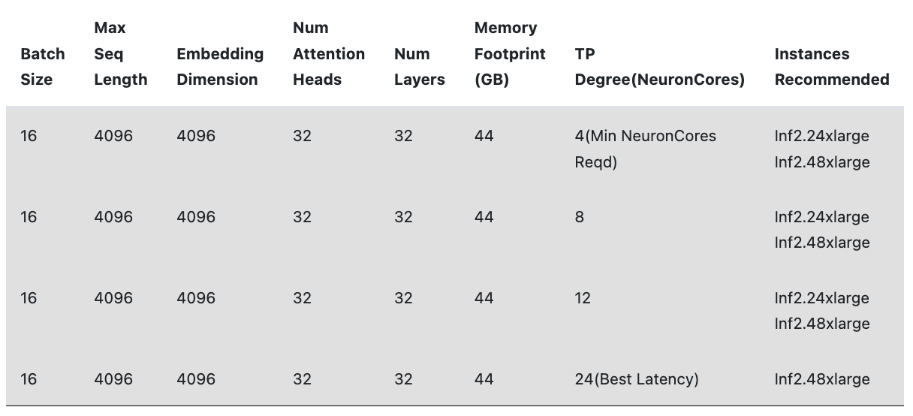

# How to Launch an inf2 ec2 instance on AWS, compile, and serve a Large Language Model (LLM) with the AWS Neuron Chip

## On AWS Launch EC2 instance from the EC2 Dashboard

1. Make sure you are in an availabilty zone that has inf2 instance types (at time of writing this it they are available in us-east-1b)
2. Choose the Amazon Machine Image (AMI) for the Deep Learning AMI Neuron (Ubuntu 22.04)

3. Choose your preffered instance type from the list of inf2 types
- Note that the recommended instance type for hosting an LLM is 24xlarge or 48xlarge (for the purpose of cost I went with an 8xlarge).

- With smaller instance size I was only able to get a 1B parameter to run, when trying an 8B parameter model the system ran out of vRAM or GPU Memory.

4. Add a route volume size of at least 60GB and launch the instance

## Connect to the instance with SSH
1. Once logged into the instance run activate the virtual environment that comes preinstalled on that AMI for neuronx
`source /opt/aws_neuronx_venv_transformers_neuronx/bin/activate`
`pip install transformers-neuronx --extra-index-url=https://pip.repos.neuron.amazonaws.com`
2. Install the Huggingface CLI if you plan on using a model from hugging face and login
`pip install -U "huggingface_hub[cli]"`
`huggingface-cli login`
3. Once logged in you will need to create a script that pulls the model
`nano download_model.py`
```
from transformers import AutoModelForCausalLM, AutoTokenizer

# Set the model ID for the Llama-2-7b-chat-hf model
model_id = "TinyLlama/TinyLlama-1.1B-Chat-v1.0"

# Set the paths where you want to save the model and tokenizer
model_path = "/home/ubuntu/models/TinyLlama-1.1B-Chat-v1.0"

# Download the model and tokenizer
model = AutoModelForCausalLM.from_pretrained(model_id)
tokenizer = AutoTokenizer.from_pretrained(model_id)

# Save the model and tokenizer to the specified directory
model.save_pretrained(model_path)
tokenizer.save_pretrained(model_path)
```
**Note that I am using a 1.1B parameter model for this example. Additionally the model must be compatible with the LlamaForCausal or MistralForCausal libraries you can find out in the [AWS Neuron Documentation](https://awsdocs-neuron.readthedocs-hosted.com/en/latest/)**

4. Create models directory and run that script
```
mkdir models
python download_model.py
```
*To check if the model downloaded correctly*
`cd models/TinyLlama-1.1B-Chat-v1.0`
`ls`
*You should see config files here*

5. Now you have to load and compile the model for Neuron to be able to properly utilize its cores
*This configuration will vary based on the instance type you chose however to run a simple model like the one in this example this is the basic setup*
`nano load_model.py`
```
from transformers import AutoModelForCausalLM, AutoTokenizer
from transformers_neuronx import LlamaForSampling

model_path = "/home/ubuntu/models/TinyLlama-1.1B-Chat-v1.0"

print("Loading Model and tokenizer")
model = AutoModelForCausalLM.from_pretrained(model_path)
tokenizer = AutoTokenizer.from_pretrained(model_path)
print("Model and tokenizer loaded successfully")
tp_degree = 1

context_length_estimate = [64, 128]

neuron_model = LlamaForSampling.from_pretrained(
        model_path,
        n_positions=2048,
        context_length_estimate=context_length_estimate,
        batch_size=1
)
print("Compiling model with Neuron")
neuron_model.to_neuron()
print("Successfully Compiled")
```
- For larger instances like the 48xlarge a script with configuration like this may be more acceptable
```
from transformers import AutoModelForCausalLM, AutoTokenizer
from transformers_neuronx import LlamaForSampling

# Path to the model directory
model_path = "/home/ubuntu/models/Meta-Llama-3-8B-Instruct"

# Load the model and tokenizer with the updated config
model = AutoModelForCausalLM.from_pretrained(model_path)
tokenizer = AutoTokenizer.from_pretrained(model_path)

# Define the tensor parallelism degree 
tp_degree = 4 #(4 or more)

# Configure and load the model for sampling with Neuron
context_length_estimate = [64, 128, 256, 512, 1024, 2048, 4096, 8192, 16384, 20480, 24576, 28672]

# Load the model into Neuron with the updated bfloat16 precision
neuron_model = LlamaForSampling.from_pretrained(
    model_path,
    n_positions=32768,
    context_length_estimate=context_length_estimate,
    batch_size=1,
    tp_degree=tp_degree,
)

# Compile the model to Neuron
neuron_model.to_neuron()
```

6. Once successfully compiled create a flask application
`nano serve_model.py`

```
from flask import Flask, request, Response
from transformers import AutoTokenizer
from transformers_neuronx import LlamaForSampling

app = Flask(__name__)

model_path = "/home/ubuntu/models/TinyLlama-1.1B-Chat-v1.0"
tokenizer = AutoTokenizer.from_pretrained(model_path)
neuron_model = LlamaForSampling.from_pretrained(model_path)
neuron_model.to_neuron()

def generate_chunks(input_text):
        input_ids = tokenizer.encode(input_text, return_tensors='pt')

        generated_ids = neuron_model.sample(input_ids, sequence_length=50)
        generated_text = tokenizer.decode(generated_ids[0], skip_special_tokens=True)

        chunk_size = 50

        for i in range(0, len(generated_text), chunk_size):
                yield generated_text[i:i+chunk_size]


@app.route('/generate', methods=['POST'])
def generate_text():
        data = request.json
        input_text = data['input_text']
        return Response(generate_chunks(input_text), content_type='text/plain')

if __name__ == '__main__':
        app.run(host='0.0.0.0', port=8080)
```
*This is a very simple version of an api for the model*

- Then serve the model and test it
`python serve_model.py`

You can test it by either opening a new window of the ec2 instance and running:
```
curl -X POST http://localhost:8080/generate \                                              
     -H "Content-Type: application/json" \
     -d '{"input_text": "Hello, how are you?"}'    
```

or from your machine launch a cli and replace localhost with the elastic ip address of your ec2 instance
